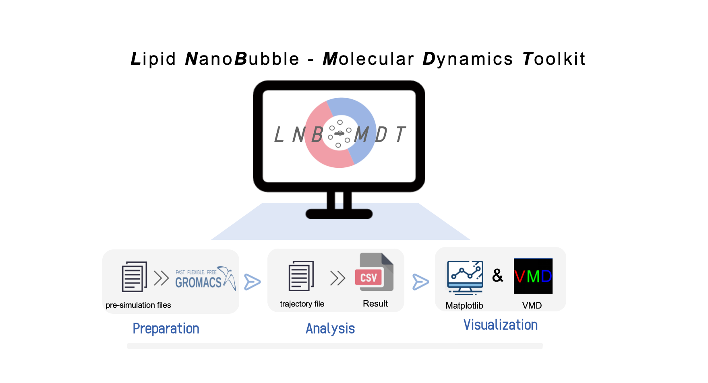

# LNB-MDT v1.0.1



**LNB-MDT** (Lipid NanoBubble Molecular Dynamics Toolkit) is a comprehensive toolkit designed for molecular dynamics simulations of lipid nanobubbles.

## Installation

### Method 1: Install from PyPI (Recommended)

The easiest way to install LNB-MDT is using pip. We recommend using conda to create a virtual environment first:

```bash
# Create conda environment
conda create -n LNB-MDT python=3.11
conda activate LNB-MDT

# Install from PyPI
pip install lnb-mdt
```

### Method 2: Install from Source

If you want to install the latest development version or contribute to the project:

```bash
# Clone the repository
git clone https://github.com/xinyuren-bio/LNB-MDT.git
cd LNB-MDT

# Create conda environment (optional but recommended)
conda create -n LNB-MDT python=3.11
conda activate LNB-MDT

# Install in editable mode
pip install -e .
```

**Note:** For editable installation, you need Python 3.10+ and pip. Using conda is recommended for managing dependencies.

### Verify Installation

After installation, verify that LNB-MDT is correctly installed:

```bash
# Check if command is available
LNB-MDT --help

# Or test in Python
python -c "import LNB_MDT; print('LNB-MDT installed successfully!')"
```

## Quick Start

After installation, you can use LNB-MDT in two ways:

### 1. Command Line Interface (CLI)

```bash
# Launch GUI
LNB-MDT UI

# Run area analysis
LNB-MDT AREA --help

# Run with test data
LNB-MDT AREA -test

# Configure VMD path
LNB-MDT VMD --path /path/to/vmd
```

### 2. Python API

```python
from LNB_MDT.analysis import Area
import MDAnalysis as mda

# Load trajectory
u = mda.Universe("system.gro", "trajectory.xtc")

# Run analysis
area_analysis = Area(u, {'DPPC': ['PO4'], 'CHOL': ['ROH']})
area_analysis.run()
```

## Documentation

For detailed documentation, including installation guide, quick start, user guide, and command line tools, please visit:

📚 **[Read the Docs - LNB-MDT Documentation](https://lnb-mdt.readthedocs.io/en/latest/)**

## File Structure

```
LNB-MDT/
├── main.py                 # Main program entry
├── requirements.txt        # Python dependencies
├── analysis/              # Analysis modules
│   ├── area.py           # Area analysis
│   ├── height.py         # Height analysis
│   ├── cluster.py        # Cluster analysis
│   ├── anisotropy.py     # Anisotropy analysis
│   ├── gyration.py       # Gyration analysis
│   ├── sz.py             # Sz order parameter analysis
│   └── density.py        # Density analysis (time and radius)
├── preparation/            # Preparation module
└── cases_lnb/             # Example lipid nanobubble data
    ├── lnb.gro           # Example topology file (Martini 3.0, DPPC:DAPC:CHOL=5:3:2)
    ├── lnb.xtc           # Example trajectory file (50-60 ns time window)
    └── README.md         # Example data description
```

## Citation

If you use LNB-MDT in your research, please cite our paper:

```bibtex
@article{ren2025lnb,
   author = {Xinyu Ren and Xubo Lin},
   title = {LNB-MDT: An Integrated Python Toolkit for Preparing and Analyzing Lipid Nanobubble Simulations},
   journal = {Journal of Chemical Information and Modeling},
   volume = {66},
   number = {1},
   year = {2025},
   month = {December},
   doi = {10.1021/acs.jcim.5c02771},
   URL = {https://pubs.acs.org/doi/10.1021/acs.jcim.5c02771},
}
```

## License

This project is licensed under the MIT License - see the [LICENSE](LICENSE) file for details.

---

**LNB-MDT v1.0** - Making lipid nanobubble simulations simpler and more efficient!
